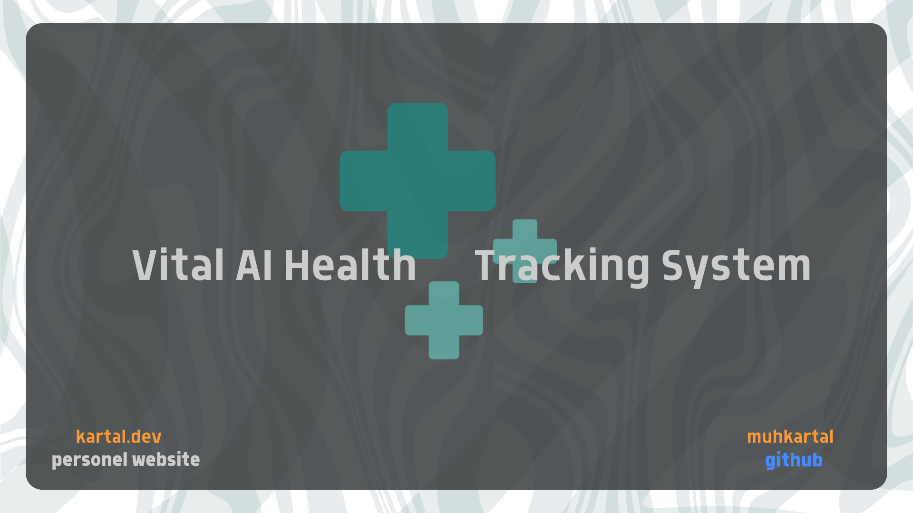

# MedExplain AI Pro

<div align="center">




**Transforming healthcare through AI-powered symptom analysis and personalized health insights**

[Getting Started](#quick-start-guide) •
[Features](#key-features) •
[Documentation](#documentation) •
[Roadmap](#strategic-roadmap) •
[Contributing](#contributing)

</div>

## Overview

**MedExplain AI Pro** is a state-of-the-art personal health assistant powered by artificial intelligence and machine learning. It provides comprehensive analysis of health symptoms, identifies potential medical conditions, uncovers health patterns, and delivers personalized insights through an intuitive interface.

This application integrates cutting-edge natural language processing, sophisticated data visualization, and predictive analytics to help users better understand their health and make informed decisions. It serves as a bridge between everyday health concerns and professional medical consultation.

**MEDICAL DISCLAIMER:** This application is for educational and informational purposes only. It does not provide medical advice, diagnosis, or treatment. Always consult a qualified healthcare professional for medical concerns.

## Key Features

### Advanced AI-Powered Symptom Analysis

<table>
<tr>
<td width="70%">
<ul>
<li><b>Multi-modal Symptom Input</b>: Seamlessly input symptoms via structured selection, natural language description, or voice recognition</li>
<li><b>Advanced Pattern Recognition</b>: Proprietary algorithms identify complex symptom patterns and potential conditions</li>
<li><b>Personalized Risk Stratification</b>: Individualized health risk evaluation based on symptoms, demographics, and medical history</li>
<li><b>Plain-language Explanations</b>: Complex medical concepts translated into clear, accessible language</li>
</ul>
</td>
<td width="30%">

</td>
</tr>
</table>

### Interactive Health Dashboard

<table>
<tr>
<td width="30%">

</td>
<td width="70%">
<ul>
<li><b>Interactive Visualization Suite</b>: Dynamic, interactive charts rendering complex health data into actionable insights</li>
<li><b>Multi-dimensional Correlation Analysis</b>: Advanced statistical modeling to identify relationships between diverse health factors</li>
<li><b>Temporal Pattern Recognition</b>: Sophisticated algorithms to detect seasonal, cyclical, and progressive health patterns</li>
<li><b>Confidence-scored Condition Tracking</b>: Transparent probability assessments for identified potential conditions</li>
</ul>
</td>
</tr>
</table>

### Natural Language Interface

<table>
<tr>
<td width="70%">
<ul>
<li><b>State-of-the-art NLP Engine</b>: Advanced natural language processing for nuanced health discussions</li>
<li><b>Medical Entity Recognition System</b>: Precision extraction of symptoms, conditions, and medical concepts from natural conversation</li>
<li><b>Evidence-based Response Generation</b>: All information grounded in validated medical knowledge bases</li>
<li><b>Contextual Learning System</b>: Responses calibrated to user's health history, literacy level, and preferences</li>
</ul>
</td>
<td width="30%">

</td>
</tr>
</table>

### Medical Literature Integration

<table>
<tr>
<td width="30%">

</td>
<td width="70%">
<ul>
<li><b>Dynamic Research Synthesis</b>: Real-time summaries of relevant medical literature in accessible language</li>
<li><b>Personalized Knowledge Recommendations</b>: Literature suggestions algorithmically tailored to individual health profiles</li>
<li><b>Semantic Search Technology</b>: Concept-based medical information retrieval across multiple authoritative sources</li>
<li><b>Credibility Assessment</b>: Transparent evaluation of medical information quality and source reliability</li>
</ul>
</td>
</tr>
</table>

### Comprehensive Health Tracking

<table>
<tr>
<td width="70%">
<ul>
<li><b>Comprehensive Health Timeline</b>: Chronological visualization of health events with interactive exploration</li>
<li><b>Progression Analysis</b>: Trend identification and projection based on historical health data</li>
<li><b>Structured Data Export</b>: Standardized health information sharing with healthcare providers</li>
<li><b>Pattern Intelligence</b>: Machine learning-powered identification of subtle, recurring health patterns</li>
</ul>
</td>
<td width="30%">

</td>
</tr>
</table>

## Technology Stack

<table>
<tr>
<th>Layer</th>
<th>Components</th>
<th>Technologies</th>
</tr>
<tr>
<td><b>Frontend</b></td>
<td>Responsive UI, Interactive Visualization, Accessibility Layer</td>
<td>Streamlit, React, D3.js, Plotly, WCAG 2.1 Compliance</td>
</tr>
<tr>
<td><b>Backend</b></td>
<td>API Gateway, Service Orchestration, Data Processing Pipeline</td>
<td>Python, FastAPI, Celery, Redis, Docker</td>
</tr>
<tr>
<td><b>Intelligence</b></td>
<td>ML Pipeline, NLP Engine, Knowledge Graph, Recommendation System</td>
<td>TensorFlow, PyTorch, Scikit-learn, Hugging Face Transformers, OpenAI API</td>
</tr>
<tr>
<td><b>Data</b></td>
<td>Medical Database, User Profiles, Symptom Patterns, Analytics Store</td>
<td>PostgreSQL, MongoDB, Redis, Elasticsearch</td>
</tr>
</table>

## Project Structure

```
medexplain_ai_pro/
├── medexplain/                        # Main package
│   ├── __init__.py                    # Package initialization
│   ├── core/                          # Core functionality
│   │   ├── __init__.py
│   │   ├── health_data_manager.py     # Health data management
│   │   ├── user_profile_manager.py    # User profile management
│   │   └── openai_client.py           # OpenAI API integration
│   │
│   ├── ml/                            # Machine learning components
│   │   ├── __init__.py
│   │   ├── symptom_predictor.py       # Symptom prediction model
│   │   ├── symptom_extractor.py       # NLP symptom extraction
│   │   └── risk_assessor.py           # Risk assessment model
│   │
│   ├── analytics/                     # Analytics components
│   │   ├── __init__.py
│   │   ├── health_analyzer.py         # Health data analyzer
│   │   └── visualization.py           # Data visualization utilities
│   │
│   ├── ui/                            # User interface components
│   │   ├── __init__.py
│   │   ├── dashboard.py               # Dashboard UI
│   │   ├── chat.py                    # Chat interface
│   │   ├── symptom_analyzer.py        # Symptom analyzer UI
│   │   ├── medical_literature.py      # Medical literature UI
│   │   ├── health_history.py          # Health history UI
│   │   └── settings.py                # Settings UI
│   │
│   ├── config.py                      # Configuration settings
│   ├── utils.py                       # Utility functions
│   └── app.py                         # Main application
│
├── data/                              # Data directory
│   ├── medical_data.json              # Medical reference data
│   └── ml_models/                     # Machine learning models
│       ├── symptom_predictor.pkl      # Trained model
│       └── risk_assessor.pkl          # Trained model
│
├── static/                            # Static assets
│   ├── css/                           # CSS files
│   │   └── style.css                  # Main stylesheet
│   └── img/                           # Image assets
│       └── logo.png                   # Application logo
│
├── tests/                             # Test suite
│   ├── test_core.py                   # Core component tests
│   ├── test_ml.py                     # ML component tests
│   └── test_analytics.py              # Analytics tests
│
├── docs/                              # Documentation
│   ├── architecture.md                # System architecture
│   └── api.md                         # API documentation
│
├── .env.example                       # Example environment variables
├── .gitignore                         # Git ignore file
├── requirements.txt                   # Dependencies
├── setup.py                           # Package setup
├── LICENSE                            # License information
└── README.md                          # This file
```

## Documentation

Comprehensive documentation is available to help you get started with MedExplain AI Pro:

<table>
<tr>
<th width="25%">For Users</th>
<th width="25%">For Developers</th>
<th width="25%">For Contributors</th>
<!-- <th width="25%">For Researchers</th> -->
</tr>
<tr>
<td>
<ul>
<li><a href="docs/user-guide">User Guide</a></li>
<li><a href="docs/best-practices">Best Practices</a></li>
</ul>
</td>
<td>
<ul>
<li><a href="docs/api-reference">API Reference</a></li>
<li><a href="docs/code-examples">Code Examples</a></li>
<li><a href="docs/integration-guides">Integration Guides</a></li>
<li><a href="docs/troubleshooting">Troubleshooting</a></li>
</ul>
</td>
<td>
<ul>
<li><a href="docs/contributing_guidlines.md">Contributing Guidelines</a></li>
<li><a href="docs/code-standards">Code Standards</a></li>
<li><a href="docs/workflow">Development Workflow</a></li>
<li><a href="docs/testing-guide">Testing Guide</a></li>
</ul>
</td>
<td>
<!-- <ul>
<li><a href="#ml-models">ML Model Documentation</a></li>
<li><a href="#datasets">Dataset Information</a></li>
<li><a href="#evaluation-methods">Evaluation Methods</a></li>
<li><a href="#research-papers">Research Papers</a></li>
</ul> -->
</td>
</tr>
</table>

## Quick Start Guide

### System Requirements

<table>
<tr>
<th>Component</th>
<th>Minimum Requirements</th>
<th>Recommended Specifications</th>
</tr>
<tr>
<td>Operating System</td>
<td>Windows 10, macOS 11, Ubuntu 20.04</td>
<td>Windows 11, macOS 12+, Ubuntu 22.04+</td>
</tr>
<tr>
<td>Python</td>
<td>3.8</td>
<td>3.10 or newer</td>
</tr>
<tr>
<td>RAM</td>
<td>4 GB</td>
<td>8 GB or more</td>
</tr>
<tr>
<td>Browser</td>
<td>Chrome 90+, Firefox 88+, Safari 14+</td>
<td>Latest version of Chrome, Firefox, or Safari</td>
</tr>
</table>

### Installation Process

```bash
# 1. Clone the repository
git clone https://github.com/yourusername/medexplain-ai-pro.git
cd medexplain-ai-pro

# 2. Set up a virtual environment
python -m venv venv
source venv/bin/activate  # On Windows: venv/Scripts/activate

# 3. Install dependencies
pip install -r requirements.txt

# 4. Set up environment variables
cp .env.example .env
# Edit .env with your OpenAI API key and other settings

# 5. Launch the application
streamlit run medexplain/app.py
```

### Docker Deployment

```bash
# Pull and run with Docker
docker pull medexplain/medexplain-ai-pro:latest
docker run -p 8501:8501 medexplain/medexplain-ai-pro:latest
```

Visit `http://localhost:8501` in your browser to start using MedExplain AI Pro.

## User Guide

### Getting Started

1. **Complete Your Health Profile**

   -  Navigate to Settings
   -  Enter personal details, conditions, and medications
   -  Set your preferences for notifications and privacy

2. **Analyze Your Symptoms**

   -  Choose your preferred input method (selection, text, or voice)
   -  Describe symptoms with relevant details
   -  Review AI-powered analysis results with confidence scores
   -  Explore potential conditions and their explanations

3. **Explore Your Health Dashboard**

   -  View your personalized health metrics
   -  Track symptom patterns over time
   -  Identify potential health correlations
   -  Monitor condition confidence scores

4. **Chat with the AI Assistant**
   -  Ask health-related questions naturally
   -  Get evidence-based responses tailored to your profile
   -  Explore recommended resources and literature
   -  Save important information to your health record

### Pro Tips

-  **Regular Updates**: Log symptoms consistently for better pattern recognition
-  **Detailed Descriptions**: Provide specific symptom details for improved analysis
-  **Voice Input**: Speak clearly and naturally when using voice recognition
-  **Data Sharing**: Use the export feature to share insights with healthcare providers

## Demo & Screenshots

<p align="center">
  
  <br>
  <em>Interactive Health Dashboard with Symptom Analysis</em>
</p>

<p align="center">
  
  <br>
  <em>Natural Language Chat Interface with Medical Entity Recognition</em>
</p>

## Roadmap

Our development roadmap is guided by user feedback, emerging technologies, and healthcare trends:

<table>
<tr>
<th>Quarter</th>
<th>Feature</th>
<th>Description</th>
<th>Status</th>
</tr>
<tr>
<td>Q2 2025</td>
<td>Wearable Device Integration</td>
<td>Seamless connectivity with health wearables for real-time data analysis</td>
<td>In Development</td>
</tr>
<tr>
<td>Q3 2025</td>
<td>Mobile Applications</td>
<td>Native iOS and Android applications with offline capabilities</td>
<td>Research Phase</td>
</tr>
<tr>
<td>Q4 2025</td>
<td>Multi-language Support</td>
<td>Interface in 10+ languages with culture-specific health information</td>
<td>Planned</td>
</tr>
<tr>
<td>Q1 2026</td>
<td>Telehealth Integration</td>
<td>Direct connection with healthcare providers based on analysis</td>
<td>Conceptual</td>
</tr>
</table>

## Contributing

We welcome contributions from the community to enhance MedExplain AI Pro:

### Contribution Process

1. **Discussion**: Start by discussing your proposed change in an issue
2. **Development**: Fork the repository and create a feature branch
3. **Testing**: Ensure comprehensive test coverage for your changes
4. **Documentation**: Update relevant documentation
5. **Pull Request**: Submit a PR with detailed description of changes

### Development Standards

<table>
<tr>
<th>Code Quality</th>
<th>Documentation</th>
<th>Testing</th>
</tr>
<tr>
<td>
<ul>
<li>PEP 8 compliance</li>
<li>Type annotations</li>
<li>Modular architecture</li>
<li>Comprehensive comments</li>
</ul>
</td>
<td>
<ul>
<li>Docstrings for all functions</li>
<li>Updated README.md</li>
<li>Detailed CHANGELOG entries</li>
<li>Architecture documentation</li>
</ul>
</td>
<td>
<ul>
<li>Unit test coverage >90%</li>
<li>Integration tests</li>
<li>Performance benchmarks</li>
</ul>
</td>
</tr>
</table>

See our [Contributing Guidelines](CONTRIBUTING.md) for detailed information on the development workflow, code standards, and review process.

## Support and Community

-  **Documentation**: [docs.medexplain.ai](https://docs.medexplain.ai)
-  **Support Portal**: [support.medexplain.ai](https://support.medexplain.ai)
-  **Community Forum**: [community.medexplain.ai](https://community.medexplain.ai)
-  **GitHub Discussions**: [GitHub Discussions](https://github.com/yourusername/medexplain-ai-pro/discussions)

## License

MedExplain AI Pro is released under the MIT License. See the [LICENSE](LICENSE) file for details.

---

<div align="center">

**MedExplain AI Pro**

Your Personal Health Intelligence Assistant

Developed by Muhammad Ibrahim Kartal | [kartal.dev](https://kartal.dev)

</div>
